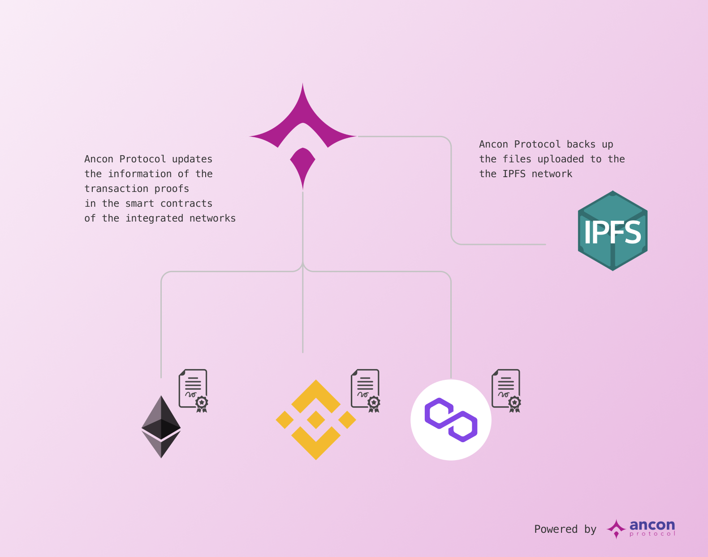
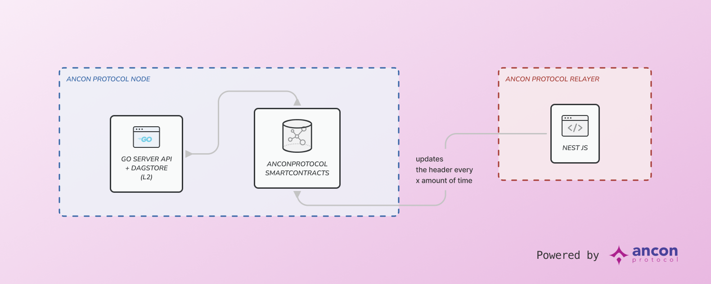

# Ancon Protocol 

### Protocol for secure offchain data economy

Ancon protocol is a new kind of SDK and technology that can be used to implement secure offchain data integrations using best of breed offchain protocols like ipfs and any blockchain with smart contracts support.

## Ancon Protocol Node - L2 Gateway

Node manages offchain data integrations and trusted offchain gateways.  It has DID web and DID key, Graphsync, and dag-json / dag-cbor technology support.

## Testnet

### Protocol Contract - AnconProtocol.sol

- `BSC Testnet`: 0x3A942779cBc73D5DA159DDcCe3FE9c1A16E5Fcba

### XDVNFT.sol

- `BSC Testnet`: 0xe756ee6397CAE88E7d3bfec73514D215E2a36f09

### DAG Network

- `Address`: 0xA6c53D3FE40ec6966653dE6503b079Dba306f589
- `Moniker`: tensta

### Features incubator dapp

- `DApp`: `https://mint.ancon.did.pa`
- `DAI Token BSC Testnet`: 0xec5dcb5dbf4b114c9d0f65bccab49ec54f6a0867

## Mainnet

### Protocol Contract - AnconProtocol.sol

- `BSC Mainnet`: 0x190cd8F5C699FCA0762fF23877a06fD2E8ae3Db2

### Ancon Token

- `BSC Mainnet`: 0x217f3bdbb0358082c99e1de01c47d1b2dba45ad5

### XDVNFT.sol

- `BSC Mainnet`: Pending release

### DAG Network

- `Address`: pending
- `Moniker`: anconprotocol

### Ancon Marketplace

- Pending

## Source code

- [Ancon Protocol Node](https://github.com/anconprotocol/node)

## API Reference

- [Ancon Protocol Node](/docs/api/reference)

## API - Core Features

- [Verifiable DAG Store](/docs/api/metadata)

## Tutorials

- [Relayers, Networks and Nodes](/docs/tutorials/networks)
- [EVM to EVM cross ownership metadata transfer](/docs/tutorials/crossownership)
- [EVM to Flow cross ownership metadata transfer](/docs/tutorials/crossownership-flow)

## Use cases

- [Data unions](/docs/tutorials/data-unions)
